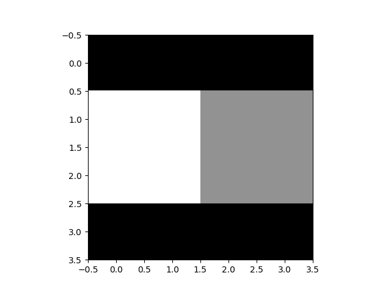
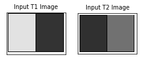
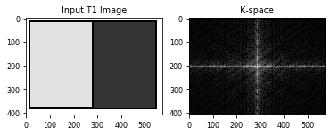
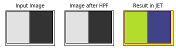
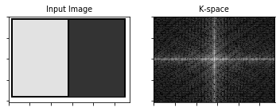

# MRI Report for Programming Task 3
## By:
* Ghada Adel Abdelaziz
* Toaa Mahmoud AbdelHakim
* Neveen Fathy
* Mostafa Tawfiq

## implementation & describtion

### **Introduction**
```
we created a 4x4 phantom in python that's found in **phantom.py** and save the output in matlab file then we browse this mat file when we run our python gui app. that's found in **Task3MRI.py** to choose from optients what you want to show from the proton density, T1 or T2 of the phantom. After you press on *start* push button you get the k space and the inverse of k space of each vector of the broswed phantom. 
```

```python
matplotlib.rcParams['font.size'] = 8.0
img = cv2.imread('C:\\Users\\Ghada\\Downloads\\created_phantom_in_python.png', 0)

plt.subplot(131),plt.imshow(img, cmap = 'gray')
plt.title('Input T1 Image'), plt.xticks([]), plt.yticks([])
plt.show()
```


```
Another Phantom: we searched on the internet for image of water and oil  in T1 and T2 and made approximated image for them in paint..in The first image..the left half is oil at T1 and right half is water at T1... the second image is same but at T2
```
```python
import sys
matplotlib.rcParams['font.size'] = 8.0
img1 = cv2.imread('C:\\Users\\Ghada\\Downloads\\phantomT1.png', 0)
img2 = cv2.imread('C:\\Users\\Ghada\\Downloads\\phantomT2.png', 0)

plt.subplot(131),plt.imshow(img1, cmap = 'gray')
plt.title('Input T1 Image'), plt.xticks([]), plt.yticks([])

plt.subplot(132),plt.imshow(img2, cmap = 'gray')
plt.title('Input T2 Image'), plt.xticks([]), plt.yticks([])

plt.show()
```




### **part a.**
* Create a function that would draw the trajectory at any point
in the space.

#### **About functions inside Task3MRI.py**

```
we follow the steps of spin eco sequence...first we multiply rf pulse.. rf pulse is simulation by rotation of spins..we have first 2 for loops to fill each element in K-space..and the second two for loops are to iterate over rows and colums of the image and take the summitions of spins and fill the first element in K-space then go through for loops again and take summition of spins to fill second element and so on..

After the phantom would have undergone a lot of changes due to gradients and taking in consideration decay and recovery in phantom (using t1 and t2), we implement a function to plot the trajectory that takes the index of the array as an input and plot.

These functions below are main parts from source code in Task3MRI.py file

MRI sequence:
```
```python
    def plot(self):

        self.DecayMx = self.ui.decayMx
        self.RecoveryMz = self.ui.recoveryMz

        self.theta = ((float)(self.ui.rotationAngle.text()))  # 5ly balk not global
        self.Tr = ((float)(self.ui.tr.text()))
        self.Te = ((float)(self.ui.te.text()))

        self.Mx = []
        self.Mz = []
        self.vector = np.matrix([0, 0, 1])  # da range sabt

        self.vector = self.rotationAroundYaxisMatrix(self.theta, self.vector)

        for i in range(len(self.time)):
            # self.vector = self.rotationAroundZaxisMatrixXY(self.Tr,speed,self.vector,self.time[i])
            self.vector = self.recoveryDecayEquation(self.T1, self.T2, 1, self.vector, self.time[i])

            self.Mx = np.append(self.Mx, self.vector.item(0))
            self.Mz = np.append(self.Mz, self.vector.item(2))

        self.DecayMx.plot(self.time, np.ravel(self.Mx), pen=self.plotCol[self.count])
        self.RecoveryMz.plot(self.time, np.ravel(self.Mz), pen=self.plotCol[self.count])

        self.RecoveryMz.addLine(x=self.Tr)
        self.RecoveryMz.addLine(x=self.Te)
        self.DecayMx.addLine(x=self.Tr)
        self.DecayMx.addLine(x=self.Te)

    def createT2(self, intensity):

        if intensity == 100:  # Gray matter
            T2 = 170
        elif intensity == 255:  # white matter
            T2 = 150
        elif intensity == 200:  # muscle
            T2 = 50
        elif intensity == 120:  # fat
            T2 = 100
        elif intensity == 25:  # protein
            T2 = 10
        elif intensity == 150:
            T2 = 255

        elif intensity > 1:  # Black => air
            T2 = (0.5 * intensity) + 20

        elif intensity <= 1:
            T2 = (intensity * 100) + 10

        return T2

    def createT1(self, intensity):

        if intensity == 100:  # Gray matter
            T1 = 255

        elif intensity == 255:  # white matter
            T1 = 100

        elif intensity == 200:  # muscle
            T1 = 180

        elif intensity == 120:  # fat
            T1 = 200

        elif intensity == 25:  # protein
            T1 = 255

        elif intensity == 0:  # Black => air
            T1 = 1

        elif intensity > 1:  # Black => air
            T1 = round((7.5 * intensity) + 50)

        else:
            T1 = (intensity * 100) + ((intensity * 100) + 50)
        return T1

    def returnIntensityfromProtonDensity(self, Pd):  # proton intensity vales from 0 till 1
        return 255 * Pd

    def rotationAroundYaxisMatrix(self, theta, vector):
        vector = vector.transpose()
        theta = (math.pi / 180) * theta
        R = np.matrix([[np.cos(theta), 0, np.sin(theta)], [0, 1, 0], [-np.sin(theta), 0, np.cos(theta)]])
        R = np.dot(R, vector)
        R = R.transpose()
        return np.matrix(R)

    def rotationAroundZaxisMatrixXY(self, TR, speed, vector, time):  # time = self.time
        vector = vector.transpose()
        theta = speed * (time / TR)
        theta = (math.pi / 180) * theta
        XY = np.matrix([[np.cos(theta), -np.sin(theta), 0], [np.sin(theta), np.cos(theta), 0], [0, 0, 1]])
        XY = np.dot(XY, vector)
        XY = XY.transpose()
        return np.matrix(XY)

    def recoveryDecayEquation(self, T1, T2, PD, vector, time):
        vector = vector.transpose()
        Decay = np.matrix([[np.exp(-time / T2), 0, 0], [0, np.exp(-time / T2), 0], [0, 0, np.exp(-time / T1)]])
        Decay = np.dot(Decay, vector)

        Rec = np.dot(np.matrix([[0, 0, (1 - (np.exp(-time / T1)))]]), PD)
        Rec = Rec.transpose()
        Decay = np.matrix(Decay)
        Rec = np.matrix(Rec)

        RD = Decay + Rec
        RD = RD.transpose()
        return RD

    def Reconstruction(self):
        theta = ((float)(self.ui.flipAngle.text()))  # 5ly balk not global
        Tr = ((float)(self.ui.TR.text()))
        Te = ((float)(self.ui.TE.text()))
        vector = np.matrix([0, 0, 1])
        Kspace = np.zeros((self.pahntomForLoop.shape[0], self.pahntomForLoop.shape[1]), dtype=np.complex_)
        # Kspace.fill(255)
        KspaceSave = abs(Kspace)
        # imsave("Kspace.png", KspaceSave)
        self.fileName5 = "Kspace_trajecrory.png"
        # self.ui.FourierMatrix.setPixmap(QtGui.QPixmap(self.fileName5).scaled(512,512))
        # self.ui.FourierMatrix.setPixmap(QtGui.QPixmap(self.fileName5))
        print(theta, Te, Tr)
        self.ForLoops(theta, Tr, Te, vector, Kspace)

    def ForLoops(self, theta, TR, TE, vector, Kspace):

        signal = [[[0 for k in range(3)] for j in range(self.pahntomForLoop.shape[0])] for i in
                  range(self.pahntomForLoop.shape[1])]
        print(signal)
        start = True

        for Ki in range(Kspace.shape[0]):
            print('Ki: ', Ki)
            # move in each image pixel
            if start:
                for i in range(self.pahntomForLoop.shape[0]):
                    for j in range(self.pahntomForLoop.shape[1]):
                        signal[i][j] = self.rotationAroundYaxisMatrix(theta, vector)
                        signal[i][j] = signal[i][j] * np.exp(-TE / self.createT2(self.pahntomForLoop[i, j]))
            else:
                for i in range(self.pahntomForLoop.shape[0]):
                    for j in range(self.pahntomForLoop.shape[1]):
                        signal[i][j] = self.rotationAroundYaxisMatrix(theta, np.matrix(signal[i][j]))
                        signal[i][j] = signal[i][j] * np.exp(-TE / self.createT2(self.pahntomForLoop[i, j]))

            # for kspace column
            for Kj in range(Kspace.shape[1]):
                print('Kj: ', Kj)
                GxStep = ((2 * math.pi) / Kspace.shape[0]) * Kj
                GyStep = ((2 * math.pi) / Kspace.shape[1]) * Ki

                for i in range(self.pahntomForLoop.shape[0]):
                    for j in range(self.pahntomForLoop.shape[1]):
                        totalTheta = (GxStep * j) + (GyStep * i)
                        z = abs(complex(np.ravel(signal[i][j])[0], np.ravel(signal[i][j])[1]))
                        Kspace[Ki, Kj] = Kspace[Ki, Kj] + (z * np.exp(1j * totalTheta))

            for i in range(self.pahntomForLoop.shape[0]):
                for j in range(self.pahntomForLoop.shape[1]):
                    signal[i][j] = self.rotationAroundYaxisMatrix(theta, vector)  # Trial
                    signal[i][j] = self.recoveryDecayEquation(self.createT1(self.pahntomForLoop[i, j]),
                                                              self.createT2(self.pahntomForLoop[i, j]), 1,
                                                              np.matrix(signal[i][j]), TR)
                    signal[i][j] = [[0, 0, np.ravel(signal[i][j])[2]]]
                    start = False
```

### **part b.**

* Generate the K-space of the image.

```
k-space is an array of numbers representing spatial frequencies in the MR image.
```
```python
import cv2
import numpy as np
import matplotlib
from matplotlib import pyplot as plt
from numpy.fft import fftshift, ifftshift, fftn, ifftn
import random
import sys
```

```python
matplotlib.rcParams['font.size'] = 8.0
np.random.seed(19680801)

img = cv2.imread('C:\\Users\\Ghada\\Downloads\\phantomT1.png', 0)
dim = range(img.ndim)

k = fftshift(fftn(ifftshift(img1, axes=dim), s=None, axes=dim), axes=dim)
k /= np.sqrt(np.prod(np.take(img1.shape, dim)))
k = np.real(k)
magnitude_spectrum = np.log(np.abs(k) + 1)

images = []

fig, axs = plt.subplots(1, 2)

for j in range(2):
    axs1[j].set_yticklabels([])
    axs1[j].set_xticklabels([])

data = [img, magnitude_spectrum]

images.append(axs[0].imshow(data[0], cmap='gray'))

axs[0].set_title('Input T1 Image')

images.append(axs[1].imshow(data[1], cmap='gray'))


axs[1].set_title('K-space')

cv2.imwrite("k-space.jpg",k)

plt.show()
```




```python
f = np.fft.fft2(img)
fshift = np.fft.fftshift(f)
f_ishift = np.fft.ifftshift(fshift)
Kspace_inverse= np.fft.ifft2(f_ishift)
Kspace_inverse = np.abs(Kspace_inverse)

plt.subplot(131),plt.imshow(img, cmap = 'gray')
plt.title('Input Image'), plt.xticks([]), plt.yticks([])
plt.subplot(132),plt.imshow(Kspace_inverse, cmap = 'gray')
plt.title('Image after HPF'), plt.xticks([]), plt.yticks([]) #HPF: high pass filter
plt.subplot(133),plt.imshow(Kspace_inverse)
plt.title('Result in JET'), plt.xticks([]), plt.yticks([])

cv2.imwrite("Inverse.jpg",Kspace_inverse)

plt.show()
```




### **part c.**

```
we are required at this point to add non uniformity effect of magnetic field  and regenerate the K-space image..so after adding random array of magnitic field, we made for loop with iterator i to iterate all over the array of non uniform magnitic field..and whenever iterator within range we multiply randomly each vector of K-space by value of magnitic field.
```

```python
Mag_Field = np.random.randint(low= 1 , high= 100, size = 15)
print (Mag_Field)
```

    [21 85 61  7 35 35 24 68 50 37 19 76 73 38 12]
    


```python
larmorFreq_Hydrogen =42.58*Mag_Field
print(larmorFreq_Hydrogen)
```

    [ 894.18 3619.3  2597.38  298.06 1490.3  1490.3  1021.92 2895.44 2129.
     1575.46  809.02 3236.08 3108.34 1618.04  510.96]
    


```python
matplotlib.rcParams['font.size'] = 8.0
np.random.seed(19680801)

img = cv2.imread('C:\\Users\\Ghada\\Downloads\\phantomT1.png', 0)
dim = range(img.ndim)
for i in range(15):
    k_nonUniform= Mag_Field[i] * fftshift(fftn(ifftshift(img, axes=dim), s=None, axes=dim), axes=dim)
    k_nonUniform /= np.sqrt(np.prod(np.take(img.shape, dim)))
    k_nonUniform =  np.real(k_nonUniform)
    magnitude_spectrum1 = np.log(np.abs(k_nonUniform) + 1)

images = []

fig, axs = plt.subplots(1, 2)

for j in range(2):
    axs[j].set_yticklabels([])
    axs[j].set_xticklabels([])

data = [img, magnitude_spectrum1]

images.append(axs[0].imshow(data[0], cmap='gray'))
axs[0].set_title('Input Image')

images.append(axs[1].imshow(data[1], cmap='gray'))
axs[1].set_title('K-space')

cv2.imwrite("k-space_nonUniform.jpg",k_nonUniform)

plt.show()
```




## Github reposetory:
* ## Task3: https://github.com/Ghada-Adel-Abdelaziz/MRI_TASK3